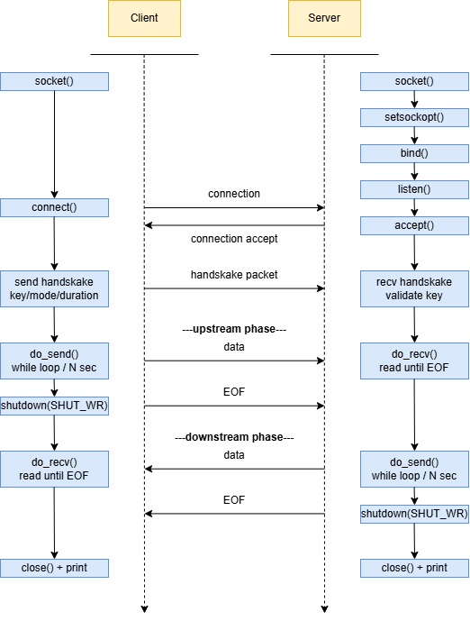
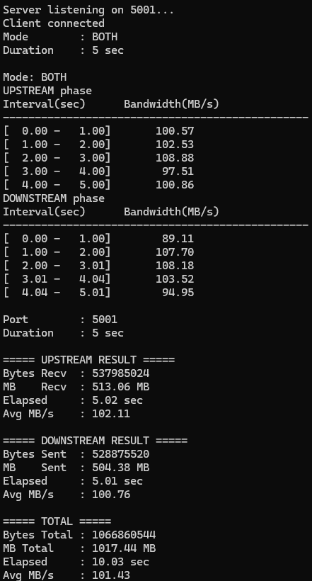
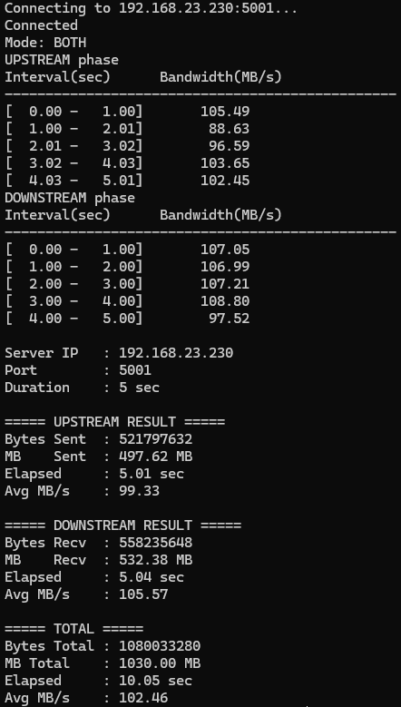

# Bandwidth_test
A lightweight TCP bandwidth measurement tool written in C, designed to measure network throughput between two endpoints.

It supports upstream, downstream, and both (upstream + downstream) testing, and displays per-second bandwidth intervals along with a final summary on both client and server sides.

## 1. Project Structure
```
.
├── build
│   ├── client          # x86 binary, runs on WSL
│   └── server          # ARM binary, runs on BMC
├── docs
│   ├── Demo_client.png
│   ├── Demo_server.png
│   └── Workflow.png
├── src
│   ├── bw_common.h     # Shared definitions and declarations
│   ├── bw_common.c     # Shared implementation (do_send, do_recv, print functions)
│   ├── client.c        # Client main
│   └── server.c        # Server main
├── .gitignore
├── LICENSE
├── Makefile
└── README.md
```

## 2. Workflow


## 3. Environment
| | Platform | OS |
|:---:|:---:|:---:|
| Client | x86 (WSL) | Ubuntu 22.04.5 LTS |
| Server | AST2600 (BMC) | Embedded Linux |

## 4. Installation
### 4.1 Clone this project
```
cd ~
git clone https://github.com/jason900227/Bandwidth_test.git
cd Bandwidth_test
```

### 4.2 Install dependencies
```
sudo apt update
sudo apt install gcc gcc-arm-linux-gnueabihf
```

### 4.3 Build
```
# Build both client (x86) and server (ARM)
make

# Build individually
make client
make server
```

### 4.4 Deploy server binary to BMC
```
scp build/server <user>@<bmc-ip>:/tmp/
```

## 5. Usage Examples
### 5.1 Start server on BMC
```
./server [-p port]
```

### 5.2 Start client on WSL
```
./client -c <server-ip> [-p port] [-t sec] [-m up|down|both]
```

### 5.3 Help
```
./server -h
./client -h
```

## 6. Demo
### 6.1 Server Result


### 6.2 Client Result
